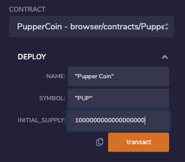

# Advanced Solidity

The following contracts both create an ERC-20 token and a crowdsale opportunity. The contracts inherit standardized contracts from the Open Zeppelin library in order to limit bug creation in smart contracts. 

After creating the smart contracts, one interacts with them in the Remix IDE. Head on over to the side bar and compile the smart contract using the correct version compiler. 

Once compiled, click on the Ethereum icon in order to deploy to either your local Ganache blockchain, a testnet or the Ethereum Mainnet via Metamask. 

Click on the drop down the arrow in order to deploy the contract. For Pupper Coin, the following should come up. 

Enter the name of your chosen coin, then its chosen Symbol and finally, the initial supply in wei which is 10 * (10**18). Once all the data is logged, click transact and your Metamask wallet should open, like so:

Click confirm. The transaction link should then be viewable in your Remix terminal. In order to confirm that the transaction has gone through, click on the link in the terminal to open up the record on your chosen Test Network. Mine is Ropsten.

Like the Pupper Coin smart contract, the CrowdSale.sol file follows the exact same process. However, there are two contracts in the file so when deploying, choose the PupperCoinSaleDeployer contract in order to deploy it to the test net. 

Click on the drop down the arrow in order to deploy the contract. For Pupper Coin, the following should come up. 

Enter the name of your chosen coin, then its chosen Symbol and finally, the wallet which is your own. Once all the data is logged, click transact and your Metamask wallet should open, like so:

Click confirm. The transaction link should then be viewable in your Remix terminal at the bottom of your screen. In order to confirm that the transaction has gone through, click on the link in the terminal to open up the record on your chosen Test Network. Mine is Ropsten.

The second contract was far more expensive likely due to the length of the contract itself. 0.01 ETH is roughly $27 CAD and were that contract to be launched to the Ethereum Mainnet, the prices would likely be similar as the Mainnet is suffering from very high volumes and not enough miners to mine the transactions.  

To import PupperCoin into one's wallet on Metmask, click Add Token at the bottom of your wallet GUI. Then add the contract's address taken from Ropsten's Website as shown above and paste it into your wallet 

Click next and your Pupper Coin should be available in your wallet.

Then you can see how many Pup you have in your wallet by going back to your account.

Additionally, one can send Test Ether to the contract by clicking on the send function in your Metamask Wallet. First copy the contract's address from ropsten.etherscan.io and paste it into the address line. Click next.

Click confirm on the next page. The interaction will likely fail as there is no exchange rate between ETH and PUP. Follow the same steps in order to interact with the other smart contract! Nonetheless, that is how you interact with the smart contract! 

